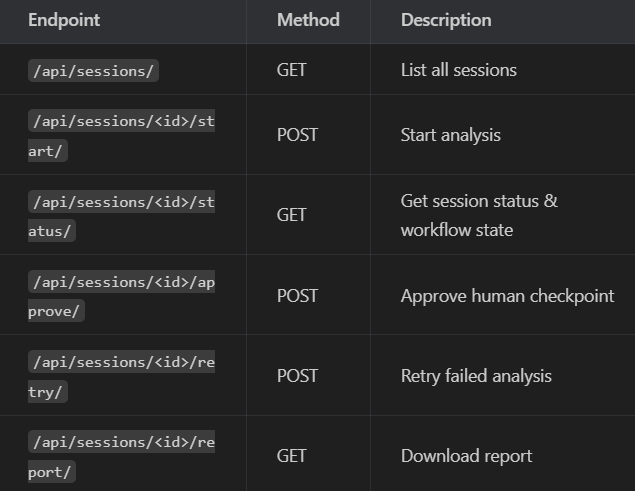
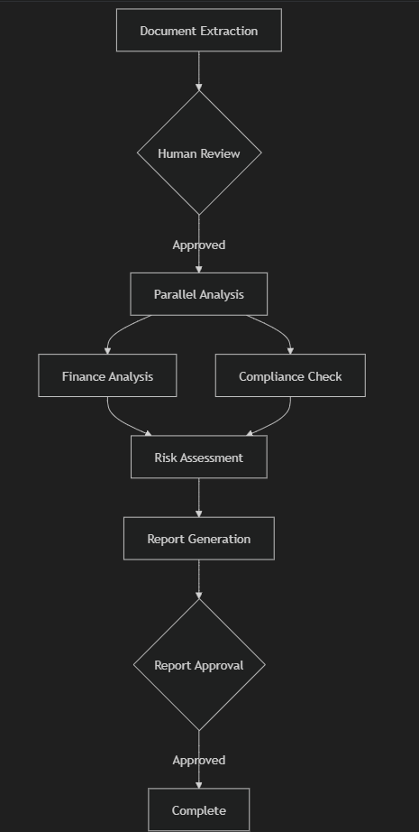

# FinancialAnalysisAgent

```
django-admin startproject config backend
```

```
cd backend
```

```
python manage.py check
```


```
python manage.py startapp api
```

```
mkdir media
```


```
python manage.py makemigrations
```

```
python manage.py migrate
```

```
python manage.py runserver
```


```
daphne -b 0.0.0.0 -p 8000 config.asgi:application
```

Verify backend

curl -X POST -F "file=D:\Varush\AgentOps\FinancialAnalysisAgent\Data\Acme_FY2024_UltraDense_Report.pdf" http://127.0.0.1:8000/api/upload/

```
http://127.0.0.1:8000
```

Frontend

cd frontend
docker pull node:24-alpine
docker run -it --rm --entrypoint sh node:24-alpine
docker run --rm -v "${PWD}/frontend:/app" -w /app node npm install
npm install
npm start

http://localhost:3000

Delete Broken install (Red underlines)
rmdir /s /q node_modules
del package-lock.json
npm install react react-dom react-scripts
npm install --save-dev @types/react @types/react-dom
npm i --save-dev @types/node

Available Endpoints:



Workflow:

